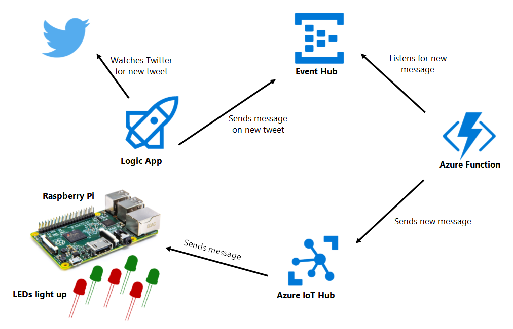

# Holiday App
Lights up an array of LEDs connected to a Raspberry Pi when there is a new tweet. 


## Hardware
- Raspberry Pi 2 Model B v1.1
- LEDs

## Technologies
- Windows 10 IoT Core
- Windows UWP App on Pi
- Event Hub
- Logic App
- Azure Function
- Azure IoT Hub

# Setup

## Azure Setup


1. Create a [Service Bus Queue](https://docs.microsoft.com/en-us/azure/service-bus-messaging/service-bus-dotnet-get-started-with-queues)
2. Create a [Logic App](https://docs.microsoft.com/en-us/azure/logic-apps/logic-apps-create-a-logic-app) to trigger on new tweet and send a message with the tweet text to the queue created in step 1
    
3. Create an [Azure IoT Hub](https://docs.microsoft.com/en-us/azure/iot-hub/iot-hub-create-through-portal) and device called `HolidayDevice`. Create a shared access policy or use an existing one and copy the connection string
4. Create an [Azure Function](https://docs.microsoft.com/en-us/azure/azure-functions/functions-create-first-azure-function) to trigger upon new message in the queue from step 1 and paste in the following code. Replace where it says `YOUR-CONNECTION-STRING-HERE` with the connection string copied from step 3
    ```js
    'use strict';

    var Client = require('azure-iothub').Client;
    var Message = require('azure-iot-common').Message;

    var connectionString = 'YOUR-CONNECTION-STRING-HERE';
    var targetDevice = 'HolidayDevice';
    var client = Client.fromConnectionString(connectionString);
    var console, context;
    var open = false;

    module.exports = function(cntxt, mySbMsg) {
        console = cntxt;
        context = cntxt;

        if (open) {
                
                var message = new Message(mySbMsg);
                message.ack = 'full';          
                console.log('Sending message: ' + message.getData());
                client.send(targetDevice, message, printResultFor('send'));
            }
        else
            checkClientOpen(open);

        console.done();
    };  

    function checkClientOpen(checkMe) {
        if (checkMe)
            return;  
        else
            openClient(); 
    }

    function openClient() {

        client.open(function (err) {
            if (err) {
                console.error('Could not connect: ' + err.message);
                open = false;
            } else {
                console.log('Client connected');
                //client.getFeedbackReceiver(receiveFeedback);
                open = true;    
            }
        });
    }

    function printResultFor(op) {
    return function printResult(err, res) {
        if (err) context.log(op + ' error: ' + err.toString());
        if (res) context.log(op + ' status: ' + res.constructor.name);
    };
    }


    function receiveFeedback(err, receiver){
    receiver.on('message', function (msg) {
        context.log('Feedback message:')
        context.log(msg.getData().toString('utf-8'));
    });
    }
    ```

## Steps to run the Raspberry Pi App
1. Change the run mode in Visual Studio to Remote Machine
2. Update the IP Address of the Remote Connection
    * Double click on Properties in the Solution Explorer and update the Debug section
3. Run the project on the Remote Machine
    * Nuget packages may need to be restored and project may need to be built or rebuilt and few times.


